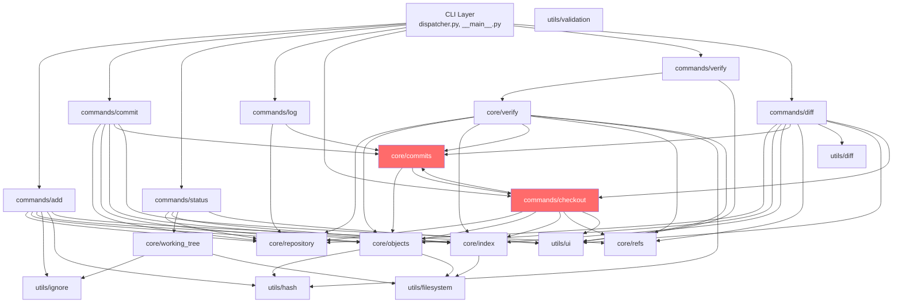

# OFS — Enterprise Product Requirements Document (PRD)

**Version:** 1.0.0  
**Date:** February 22, 2026  
**Classification:** Internal Engineering — Air-Gapped Systems  
**Scope:** Phase 0–6 (Implemented Features Only)

---

## 1. Executive Summary

OFS (Offline File System) is a **content-addressable, local-first version control system** designed for air-gapped environments where network connectivity is unavailable or prohibited. It provides deterministic file versioning, integrity verification, and history management using only the Python standard library.

OFS targets single-user workstations in classified, industrial, or disconnected environments where Git's network-centric model is inapplicable. It guarantees that identical inputs always produce identical outputs, all writes are atomic, and all stored data is tamper-evident through SHA-256 content addressing.

**Current state:** 348 tests passing, 87.06% code coverage, zero external dependencies.

---

## 2. Product Vision

> Enable engineers working in offline, air-gapped environments to maintain a complete, verifiable file history with the simplicity of a single-user system and the integrity guarantees of a content-addressable store.

### Design Principles

| # | Principle | Implementation |
|---|-----------|---------------|
| 1 | **Offline-First** | Zero network code. No sockets, HTTP, DNS, or IPC. |
| 2 | **Zero Dependencies** | Pure Python 3.10+ standard library only. |
| 3 | **Deterministic** | Same inputs → same outputs. No UUIDs, no random IDs. |
| 4 | **Transparent** | Human-readable JSON formats. Text-based refs. |
| 5 | **Fail-Safe** | Atomic writes. Corruption detection on every read. |
| 6 | **Auditable** | Complete linear history. Tamper-evident hashing. |
| 7 | **Immutable** | History is append-only. Objects never deleted or modified. |

---

## 3. Architectural Constraints

### Hard Constraints (Invariant)

- **No networking.** No imports from `socket`, `http`, `urllib`, `requests`, or any network library.
- **No concurrency.** No threads, no async, no multiprocessing. Single-threaded execution only.
- **No external dependencies.** `requirements.txt` contains only test tooling (`pytest`, `pytest-cov`).
- **No multi-user.** Single user per repository. No locking, no merge conflicts.
- **No branching.** Linear commit history only (001 → 002 → 003 → ...).
- **No compression.** Objects stored as raw bytes.
- **Atomic writes.** All metadata mutations use temp-file + atomic-rename pattern.

### Soft Constraints (May Evolve in Future Phases)

- Maximum file size: 100MB (enforced by validation)
- Maximum repository size: 10GB
- Maximum commit count: 10,000
- Maximum files per repository: 10,000

---

## 4. Repository Layout

```
project/
├── .ofs/                        # Metadata directory (hidden)
│   ├── objects/                  # Content-addressable blob storage
│   │   └── ab/                  # First 2 hex chars of SHA-256
│   │       └── cdef0123...      # Remaining 62 hex chars (file content)
│   ├── commits/                 # Commit history (sequential JSON files)
│   │   ├── 001.json
│   │   ├── 002.json
│   │   └── ...
│   ├── refs/
│   │   └── heads/
│   │       └── main             # Pointer to latest commit ID
│   ├── index.json               # Staging area state
│   ├── HEAD                     # Current branch or detached commit pointer
│   └── config.json              # Repository configuration
├── .ofsignore                   # User-defined ignore patterns
└── [working files]              # User's actual project files
```

---

## 5. Object Model

### Content-Addressable Storage

Every file's content is stored by its SHA-256 hash in a two-level directory structure:

- **Hash function:** SHA-256 (FIPS 140-2 compliant, 64 hex character output).
- **Deduplication:** Identical file contents are stored once regardless of filename or path.
- **Immutability:** Objects are write-once. Once stored, content is never modified.
- **Integrity:** Every `retrieve()` operation recomputes the hash and validates it matches the expected value.

### Storage Operations

| Operation | Complexity | Atomicity |
|-----------|-----------|-----------|
| `store(content)` | O(len(content)) for hashing + O(1) write | Atomic (temp + rename) |
| `retrieve(hash)` | O(len(content)) for hash verification | Read-only |
| `exists(hash)` | O(1) filesystem path check | Read-only |
| `verify(hash)` | O(len(content)) for hash recomputation | Read-only |

---

## 6. Commit Model

### Sequential Linear History

Commits use sequential numeric IDs (`001`, `002`, `003`, ...) instead of content hashes. Each commit is a self-contained JSON file.

### Commit Object Schema

```json
{
  "id": "003",
  "parent": "002",
  "message": "Add user authentication module",
  "author": "jsmith",
  "email": "jsmith@localhost",
  "timestamp": "2026-02-22T10:30:00.000000Z",
  "files": [
    {
      "path": "src/auth.py",
      "hash": "a7f8e3b92c1d4f6e...",
      "size": 4096,
      "mode": "100644",
      "action": "added"
    }
  ]
}
```

### File Actions

| Action | Meaning |
|--------|---------|
| `added` | New file not present in parent commit's tree |
| `modified` | File exists in parent but hash changed |
| `deleted` | File present in parent's tree, removed in this commit |
| `unchanged` | File staged but identical to parent (recorded for completeness) |

### Tree State Reconstruction

To determine the complete file tree at commit N, OFS replays the commit chain from the root (001) to N, applying each commit's file actions sequentially. Deletions remove paths; additions/modifications upsert paths.

**Complexity:** O(D × F_avg) where D = chain depth and F_avg = average files per commit.

---

## 7. Index Model

### Staging Area

The index (`index.json`) holds the set of files staged for the next commit. It is a JSON array of entry objects:

```json
[
  {
    "path": "src/main.py",
    "hash": "abc123def...",
    "size": 4096,
    "mode": "100644",
    "mtime": 1708560000.0
  }
]
```

### Index Operations

| Operation | Complexity | Persistence |
|-----------|-----------|-------------|
| `add(path, hash, metadata)` | O(n) scan + O(n) serialize | Immediate atomic write |
| `remove(path)` | O(n) scan + conditional write | Conditional atomic write |
| `find_entry(path)` | O(n) linear search | Read-only |
| `get_entries()` | O(n) copy | Read-only |
| `clear()` | O(1) reset + atomic write | Immediate atomic write |
| `has_changes()` | O(1) length check | Read-only |

### Atomicity

Index is written atomically on every mutation using temp-file + rename. This guarantees that a crash during write never produces a partial index.

---

## 8. Diff Model

### Comparison Scenarios

| Command | Comparison | Data Sources |
|---------|-----------|--------------|
| `ofs diff` | Working directory vs. staged index | File system + object store |
| `ofs diff --cached` | Staged index vs. HEAD commit tree | Object store + commit tree |
| `ofs diff <commit>` | Working directory vs. specific commit | File system + commit tree |
| `ofs diff <c1> <c2>` | Commit tree 1 vs. commit tree 2 | Two commit trees |

### Algorithm

- **Engine:** Python `difflib.unified_diff` with 3 lines of context.
- **Format:** Standard unified diff (compatible with `patch` tool).
- **Binary detection:** First 8KB scanned for null bytes (`\x00`).
- **Encoding:** UTF-8 with `errors='replace'` for lossy fallback.

### Color Output (Phase 6)

| Element | Color |
|---------|-------|
| Additions (`+`) | Green |
| Deletions (`-`) | Red |
| Chunk headers (`@@`) | Cyan |
| Diff header | Bold |

Color is **automatically disabled** when:
- `NO_COLOR=1` environment variable is set
- Output is piped/redirected (not a TTY)
- `--no-color` global flag is passed

---

## 9. Integrity Model

### Verification Architecture

`ofs verify` performs four independent integrity checks:

| Component | Check | Cost |
|-----------|-------|------|
| **Objects** | Read every object file, recompute SHA-256, compare with filename | O(Obj × avg_size) |
| **Index** | Validate JSON structure, verify all referenced hashes exist in object store | O(Idx) |
| **Commits** | Validate JSON structure, verify parent chain, verify all file hashes exist | O(C × F) |
| **Refs** | Validate HEAD file, resolve symbolic ref, verify pointed commit exists | O(1) |

### Corruption Detection

- **Silent data rot:** Detected by hash mismatch on object read.
- **Partial writes:** Impossible due to atomic write pattern.
- **Missing objects:** Detected by `exists()` checks during verify and checkout.
- **Broken parent chain:** Detected by commit chain validation.

---

## 10. CLI Model

### Command Reference

| Command | Arguments | Description | Exit Codes |
|---------|-----------|-------------|------------|
| `ofs init` | — | Initialize new repository | 0=success, 1=error |
| `ofs add <paths>` | `paths` (1+) | Stage files for commit | 0=staged, 1=none found |
| `ofs commit -m <msg>` | `-m` (required) | Create commit from staging | 0=success, 1=error |
| `ofs status` | — | Show repo status | 0=always |
| `ofs log [-n N] [--oneline]` | `-n`, `--oneline` | Show commit history | 0=always |
| `ofs checkout <cid> [--force]` | `commit_id`, `--force` | Restore to commit state | 0=success, 1=error |
| `ofs verify [--verbose]` | `--verbose` | Check repository integrity | 0=clean, 1=errors |
| `ofs diff [c1] [c2] [--cached]` | optional commits, `--cached` | Show file differences | 0=success, 1=error |

### Global Flags

| Flag | Effect |
|------|--------|
| `--version` | Print `OFS 1.0.0` and exit |
| `--no-color` | Disable ANSI color output |
| `--help` | Show help text |

### Progress Indicators

For long-running operations (`add`, `checkout`, `verify`), a terminal progress bar is displayed when running interactively. The progress bar auto-disables when output is piped.

---

## 11. Atomicity Guarantees

### Write Pattern

All metadata mutations follow the atomic write protocol:

```
1. Write content to <target>.tmp (temp file)
2. Call Path.replace(<target>)          # Atomic on POSIX and Windows
3. Temp file is now gone; target contains new content
```

### Crash Safety Matrix

| Crash Point | State After Recovery |
|-------------|---------------------|
| During temp file write | Original file intact, orphaned `.tmp` file |
| During atomic rename | Either old or new content (never partial) |
| After rename completes | New content fully committed |

### Coverage

| Component | Uses Atomic Write? |
|-----------|-------------------|
| Object store (`store()`) | ✅ Yes — via `atomic_write()` |
| Index (`_save()`) | ✅ Yes — via `atomic_write()` |
| Commit save | ⚠️ Manual temp+rename (should use `atomic_write()`) |
| Ref update | ⚠️ Uses `Path.replace()` directly (correct but inconsistent) |

---

## 12. Determinism Guarantees

| Property | Guarantee |
|----------|-----------|
| **Object hashing** | SHA-256 of raw bytes. Same content → same hash, always. |
| **Commit IDs** | Sequential integers from `001`. Same commit order → same IDs. |
| **Index ordering** | Append order (insertion order). Deterministic for same sequence of `add` calls. |
| **Tree reconstruction** | Replays commits 001→N. Same history → same tree, always. |
| **Diff output** | `difflib.unified_diff` is deterministic for identical inputs. |
| **Timestamps** | `datetime.utcnow()` — non-deterministic but not used for identity. |

---

## 13. Complexity Analysis

| Operation | Time | Disk I/O | Memory |
|-----------|------|----------|--------|
| `ofs init` | O(1) | Create ~5 directories + 3 files | O(1) |
| `ofs add <file>` | O(file_size) | Read file + hash + store + write index | O(file_size) |
| `ofs add .` (N files) | O(N × avg_size) | N file reads + N stores + N index writes | O(max_size) |
| `ofs commit` | O(D × F_avg + Idx) | Tree reconstruction + commit write + ref update | O(tree_size) |
| `ofs status` | O(W × P + Idx) | Walk directory + read index + hash comparisons | O(W + Idx) |
| `ofs log` | O(C) | Read all commit JSONs | O(C) |
| `ofs checkout` | O(D×F + F_r) | Tree reconstruction + F_r object reads + F_r file writes | O(tree + max_file) |
| `ofs verify` | O(Obj + Idx + C×F) | Read ALL objects + index + commits | O(Obj_count) |
| `ofs diff` | O(D×F + F_d × S) | Tree reconstruction + F_d object reads | O(tree + max_diff) |

---

## 14. Performance Characteristics

### Typical Operation Latencies

| Operation | 10 files | 100 files | 1000 files |
|-----------|----------|-----------|------------|
| `ofs add .` | <100ms | <500ms | <3s |
| `ofs commit` | <50ms | <200ms | <1s |
| `ofs status` | <100ms | <300ms | <2s |
| `ofs diff` | <100ms | <500ms | <3s |
| `ofs verify` | <200ms | <1s | <5s |
| `ofs checkout` | <150ms | <500ms | <3s |

### Scaling Limits

| Resource | Practical Limit | Bottleneck |
|----------|----------------|------------|
| Files per repo | ~10,000 | Index linear scan |
| Commits | ~10,000 | Tree reconstruction cost |
| File size | 100MB (enforced) | Memory — entire file loaded |
| Repo size | ~10GB | Disk space |

---

## 15. Failure Modes

| Failure | Detection | Recovery |
|---------|-----------|----------|
| Corrupted object | Hash mismatch on `retrieve()` | `ValueError` raised; verify identifies affected files |
| Corrupted index | JSON parse failure | Index resets to empty with warning |
| Corrupted commit | JSON parse failure | Skipped in `list_commits()`; flagged by verify |
| Missing object | `FileNotFoundError` on `retrieve()` | Checkout fails with clear error message |
| Disk full | Write failure during atomic write | Temp file may remain; original file intact |
| Permission denied | `PermissionError` during file operations | Operation fails with error message |
| Path too long (Windows) | OS error on deep directory nesting | Error propagated to user |

---

## 16. Security Model (Air-Gapped)

### Threat Model

| Threat | Protected? | Mechanism |
|--------|-----------|-----------|
| Accidental file overwrite | ✅ Yes | History preserves all versions |
| Silent data corruption | ✅ Yes | SHA-256 verification on every read |
| Accidental deletion | ✅ Yes | Objects are content-addressed (never overwritten) |
| Tampered history | ✅ Detectable | Hash chain verification via `ofs verify` |
| Network exfiltration | ✅ Impossible | Zero network code |
| Malicious local user | ❌ No | No access controls, no encryption at rest |
| Physical device theft | ❌ No | No encryption (use full-disk encryption externally) |

### Cryptographic Properties

- **Algorithm:** SHA-256 (256-bit digest, FIPS 140-2 approved).
- **Collision resistance:** 2^128 operations (computationally infeasible).
- **Pre-image resistance:** 2^256 operations.
- **No HMAC/signatures:** History is tamper-evident but not tamper-proof.

---

## 17. Known Limitations

| # | Limitation | Impact | Workaround |
|---|-----------|--------|------------|
| 1 | No branching | Cannot work on parallel features | Use filesystem copies |
| 2 | No merge | Cannot combine divergent histories | N/A (linear only) |
| 3 | No networking | Cannot share repos directly | Sneakernet (USB, etc.) |
| 4 | No encryption | Data readable by anyone with FS access | Use OS-level encryption |
| 5 | No compression | Objects stored at full size | External compression |
| 6 | Linear scan index | Slow for >10K staged files | Keep staging area small |
| 7 | Full content in memory | Cannot handle files >100MB | Enforced file size limit |
| 8 | No partial checkout | Always restores complete tree state | N/A |
| 9 | No file rename tracking | Renames appear as delete + add | N/A |
| 10 | UTC-only timestamps | No timezone support | Use UTC consistently |

---

## 18. Phase 7–9 Roadmap (Future — NOT IMPLEMENTED)

> [!IMPORTANT]
> The following phases are planned but **not implemented**. They are documented here for roadmap visibility only. No code exists for these features.

### Phase 7: Packaging & Distribution
- PyPI package (`pip install ofs`)
- Platform-specific installers
- Shell completions (bash, zsh, PowerShell)

### Phase 8: Advanced Features
- Branching and merging (DAG-based history)
- Stashing uncommitted changes
- File rename detection
- Tagging commits
- Configurable diff context lines

### Phase 9: Performance & Scale
- Object compression (zlib/lz4)
- Pack files (delta compression)
- Streaming hash computation for large files
- Index tree structure (B-tree for O(log n) lookups)
- Snapshot checkpoints for tree reconstruction

---

## Appendix A: Module Dependency Graph



> [!WARNING]
> Red nodes indicate the circular dependency: `core/commits/create.py` imports from `commands/checkout/execute.py`.

---

## Appendix B: File Inventory

| Layer | Module | Files | Lines |
|-------|--------|-------|-------|
| CLI | `ofs/cli/` | 2 | ~145 |
| Commands | `ofs/commands/` | 14 | ~1200 |
| Core | `ofs/core/` | 13 | ~900 |
| Utils | `ofs/utils/` | 12 | ~550 |
| Tests | `tests/` | 30+ | ~3000 |
| Docs | `docs/` | 10+ | ~2500 |
| **Total** | | **~80** | **~8300** |

---

*End of Document*
